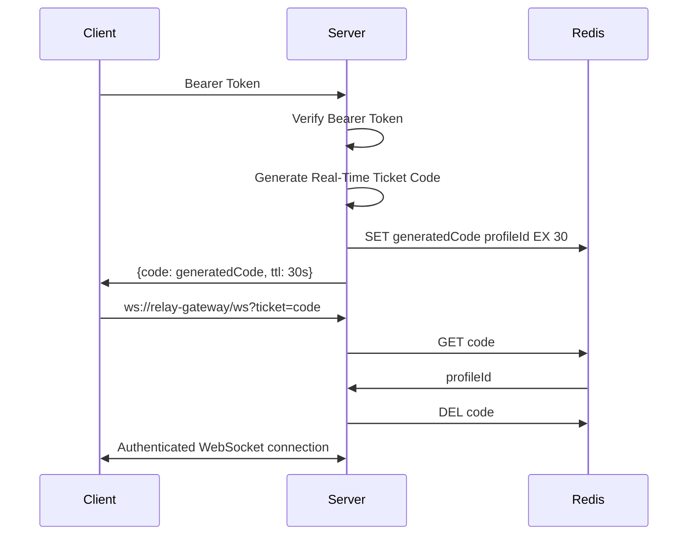
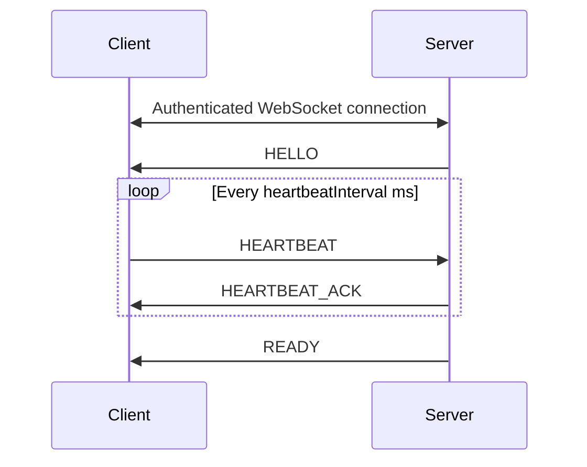
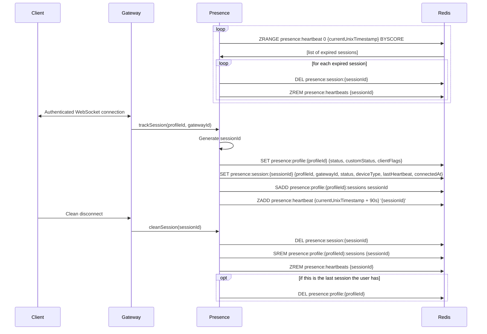

# Relay Real-Time Gateway

This document outlines the specifics of the real-time gateway of Relay.

## Background & Motivation

Users expect to retrieve notifications of realtime events while using any platform but especially a messaging platform. Real-time events include the obvious messages sent in rooms they are part of, friend's presence status updates, typing indicators, but also includes events for workspace updates (workspace name), friends profile updates (profile image, display name), new workspace roles, and countless other events that need to be sent to keep the client up to date without having to do a full refresh. The main challenge with a realtime gateway is scalability. The gateway will have different scaling properties from the rest of the application. The following outlines the solutions to this challenge and its integration with the applicaiton as a whole.

## Design

### Client-Server Connection

The primary technology used by the real-time gateway to connection clients with the server is WebSocket. WebSocket is built on top of TCP and allows for efficient bi-directional communication between a client and server. WebSocket was chosen as the primary technology because its the dominant real-time communication protocol used today with implementations in every major web and native environment. WebTransport is another technology that was researched but it has not met the browser coverage expected; however, support for WebTransport alongside WebSocket is planned after feature completeness. Legacy transport mechanisms, like long-polling, might be interesting to implement but practically doesnt make sense so there is no plan to implement.

### Authentication

WebSocket does not officially allow for any headers besides `Sec-WebSocket-Protocol`, which is used for sub-protocol negotiation, thus a different authentication mechanism than bearer token in the `Authorization` header was needed. The solution was a ticketing system. An initial `GET` request is sent to `/api/realtime/ticket` returns a real-time ticket code that can be used as a query parameter in the WebSocket request to authenticate the connection. First, the user's bearer token is sent in the `GET /api/realtime/ticket` request, server verifies the bearer token and extracts the profileId from the `sub` claim. Then a ticket is created with a random alpha-numeric code of length 8 and the extracted profileId. The ticket is saved in Redis with a time to live (ttl) of 30 seconds. 30 seconds was chosen as long enough that even slow connections should be able to authenticate but short enough that an attack is unlikely and the code is deleted from Redis after authentication to mitigate replay attacks. When the initial WebSocket connection is requested by the client, the code can be provided in the `ticket` query parameter where the server can extract it in a handshake interceptor before finalizing the WebSocket connection. The benefit to this ticket system is that there are no unauthenticated WebSocket connections. An alternative approach would to provide the bearer token inside the first message of an unauthenticated connection and then the server can verify the token and then mark that connection as authenticated, but this leaves the gateway open to Denial of Service (DoS) attacks because clients can created unlimited unauthenticated connections for brief periods of time, and it adds complexity on the server because you have to keep track of authenticated and unauthenticated connections separately.



### Events

Events sent from server to client contain the an operation code, event type, sequence number, and payload. The operation code indicates the operation, whether that be `DISPATCH`, `HEARTBEAT`, `DISCONNECT`, `RESUME`, etc. The event type is used for the `DISPATCH` operation and tells the client what has changed (`MESSAGE`, `WORKSPACE`, etc) and how it has changed (`CREATE`, `UPDATE`, `DELETE`). The sequence code is resuming a connection (TCP already gaurentees no dropped messages), the sequence code can be provided by the client in a `RESUME` operation to notify the gateway that it needs to retrieve the events since then. The payload is a generic field that contains the actual data about the create, update, delete, etc. The payload can be of any shape.

#### Example Event

```json
{
    "op": 0,
    "d": {
        "author": {
            "profileId": "e57307e4-d8f6-4738-9c34-f863115c8aa1",
            "username": "andrew"
        },
        "content": "This is an example",
        "roomId": "8d58a129-3b6a-4a0b-8520-a4c6669991ac"
    },
    "s": 21,
    "t": "MESSAGE_CREATE"
}
```

#### Server to Client Events

Events are sent from server to client with the `DISPATCH` opcode (opcode `0`). Examples of event types include `MESSAGE_CREATE`, `PRESENCE_UPDATE`, `ROOM_DELETE`. Any action that another user can take and your client needs to reflect immediate, has an event type. A full list of events types can be found in the API documentation.

#### Client to Server

Clients may send events to the server to resume a previous session, update the presence status, send heartbeats, etc. Relay does not support sending requests over the real-time connection, i.e. clients may not send messages to a room over their WebSocket connection, that is strictly a REST API request. The thought process with that decision is its easier to gaurentee a message has been sent if we have confirmation from a regular `POST` request rather than send a real-time event and wait for a real-time event back with the message contents. This may change in the future as a big advantage of everything going over the WebSocket connection would be minimal authentication and TLS handshakes, potentially improving throughput.

### Sessions

A session is initiated when the client requests a WebSocket connection with the server. After the WebSocket connection is created, the server send a `READY` event with data that the client needs to render the initial view and a sessionId used for resuming. After the `READY` event, the session has been created and events will begin to send the incrementing sequence number. A heartbeat is used to keep sessions alive, a `heartbeatInterval` is sent during initialization which dictates how often to send the heartbeat in milliseconds.

#### Heartbeat & Heartbeat Ack

Heartbeats are used to eliminate stale sessions. If a session has not recently received a heartbeat, the session is destroyed preventing a resume. After the WebSocket connection is created, the gateway will send a `HELLO` event that contains the `heartbeatInterval`, the interval in milliseconds that the client should be sending a heartbeat using the `HEARTBEAT` event. After the client sends a heartbeat, it should expect a `HEARTBEAT_ACK` event from the server, indicating that the server has acknowledged the heartbeat. The only data sent in the `HEARTBEAT` event is the last sequence number received and the `HEARTBEAT_ACK` event contains no data.

##### Example `HELLO`

```json
{
    "op": 10,
    "d": {
        "heartbeatInterval": 30000
    }
}
```

##### Example `HEARTBEAT`

```json
{
    "op": 1,
    "d": 456
}
```

##### Example `HEARTBEAT_ACK`

```json
{
    "op": 11
}
```

#### Resume

If a client disconnects for any reason, they can reinitialize a connection and send a `RESUME` event with their previous sessionId and sequence number to resume their previous session and retrieve any events sent since the disconnect.

##### Example `RESUME`

```json
{
    "op": 6,
    "d": {
        "sessionId": "8f434f7b-e9d2-4e33-af3a-ec389cfcdaec",
        "s": 456
    }
}
```

#### Example Session Initialization



#### Presence & Fanout

Presence and fanout are important aspects of any real-time platform, thus they are defined in their own documents to prevent too much domain knowledge from leaking into the gateway. The gateway should be dumb and purely infrastructure with no knowledge of what the application itself is doing.

## Implementation

### Profile Presence

A user can have a single profile presence record that contains their global status, as opposed to a per client status, their custom status to display to other users, and thier client flags, a bitmap indicating which clients are actively being used (i.e. browser, mobile, desktop).

#### Statuses

If two clients have different statuses, the lowest value will win. For example, if browser is Online (`1`) and mobile is Do not disturb (`0`), other users will see you as Do not disturb (`0`).

`0`: Do not disturb
`1`: Online
`2`: Away
`3`: Offline

#### Custom Status

Users can choose to insert their own custom status. A custom status should not exceed 140 characters.

#### Client Flags

Each device is represented in a small bitmap with the following positions.

Browser: `1 << 0 = 0b0001`
Desktop: `1 << 1 = 0b0010`
Mobile: `1 << 2 = 0b0100`

As a concrete example, if a user has both a browser and mobile session active, the clientFlags field would be as follows:

```
(1 << 0) & (1 << 2) = 0b0101
```

#### Example Profile Presence Record

```json
presence:profile:{profileId} -> {
    status: 0,
    customStatus: 'Relaying...',
    clientFlags: 0b000
}
```

### Session Presence

A user can have multiple session presence records, one per active client. If a user is connected with their browser and mobile, they would have a single profile presence record but two session presence records. Session presence records contain information about each WebSocket connection, the gateway identifier, per session status, connection time, last heartbeat, device type. When a message needs to be sent to a user, the presence service can search for all the sessions presence services using the user's profileId, then publish the message to each gatewayId in the session presence record.

#### Example Session Presence Record

```json
presence:session:{sessionId} -> {
    profileId: 'e6d30c1e-b6df-49e1-a2dd-32208051ed3f',
    gatewayId: 'ab4ad9c1-b044-4c68-af3c-acc028d2a325',
    status: 1,
    deviceType: 0,
    lastHeartbeat: 1775099183,
    connectedAt: 1775099067
}
```

#### Example Session Presence Set

```json
presence:profile:{profileId}:sessions -> [
    '0f0c6e65-7801-4e06-8744-15e2bac79eff',
    'c7477b45-943f-49cc-b26b-5ae11b026137'
]
```

### Heartbeat & Session Expiry

Keeping track of active sessions at scale is rather difficult, there is no easy to accurately and efficiently clean up sessions that missed their heartbeat window. The intuitive approach is to use the Redis time-to-live mechanism and reset the ttl for the session when it sends a heartbeat, but this does not allow the server to perform the rest of the clean up. We still need to at least remove the session id from the profiles session presence set.

The next step is to build a cleanup job that can run in the background and actively check sessions and clean them up after they have missed their heartbeat window. The difficulty here is efficiency, we can't simple maintain a list of sessions to loop through to find expired sessions. This is `O(N)` and will not hold up at massive scale, but realistically would hold up for a long time. What we can instead do is use a sorted set in Redis to keep a list of every session along with their heartbeat expiry time as a unix epoch, then every few seconds we can get all the expired sessions by sorting the set and retrieving the range from `0` to `currentUnixTimestamp`.

#### Flow


